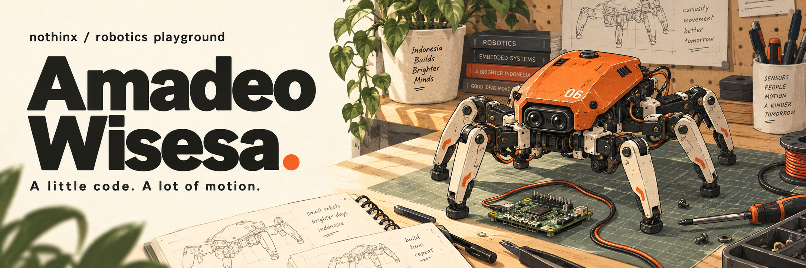

  

  <a href="#on-the-workbench">Projects</a> &nbsp; / &nbsp;
  <a href="#the-toolbox">Toolbox</a> &nbsp; / &nbsp;
  <a href="https://github.com/nothinx/Pengajaran-Program-Deo">Learn C++ with me</a> &nbsp; / &nbsp;
  <a href="mailto:wisesaamadeo@gmail.com">Say hello</a>

### Hey, I'm Deo 👋

I build robots, write the firmware that moves them, and teach people how to make their first program work. Based in **Indonesia**, with a workbench somewhere between **legged robotics, embedded systems, and computer vision**.

My work includes **R2C robotics**, teaching **PPD at FTEK UKSW**, and agriculture experiments for **TEKNOFEST**. This is where I share the code, the experiments, and the things I learn along the way.

> Hardware gets the multimeter. Software gets `printf`.

## On the workbench

### 01 / Six legs. One very interesting debugging session.

**[Hexapod KRSRI](https://github.com/nothinx/legacy-2026)**

Making a six-legged robot walk, sense its surroundings, and search for victims. Inverse kinematics and gait control run on a Teensy 4.1, with Raspberry Pi vision alongside the motion firmware.

`C++` · `Teensy 4.1` · `Inverse kinematics` · `Raspberry Pi` · `YOLO`

[Explore the firmware](https://github.com/nothinx/legacy-2026/tree/master/HEXAPOD_KRSRI_2026) · [See the vision system](https://github.com/nothinx/legacy-2026/tree/master/RASPI_VISION_KRSRI)

### 02 / A second opinion. A second life.

**[RECELL-AI](https://github.com/nothinx/RECELL-AI)**

A used-battery grading system combining visual inspection with electrical measurements. Computer vision, state-of-health estimation, STM32 control, and a desktop dashboard come together around one question: what can this battery still do?

From the RECELL-AI repository: the dashboard after a grading cycle.

`Python` · `YOLOv8` · `XGBoost` · `STM32` · `PyQt`

### 03 / Out of the lab. Into the field.

**[TEKNOFEST agriculture experiments](https://github.com/nothinx/otw_turki)**

Microcontroller code and sensor experiments for an agriculture competition project. Working where electronics, environmental sensing, and the physical world meet.

### 04 / Everyone starts with a first program.

**[Pengajaran Program Deo](https://github.com/nothinx/Pengajaran-Program-Deo)**

C++ learning materials for students at FTEK UKSW: setup, variables, operators, and input/output. Small steps toward understanding what the code actually does.

[Start with topic 1](https://github.com/nothinx/Pengajaran-Program-Deo/tree/master/TOPIK_1) · [Browse all my repositories](https://github.com/nothinx?tab=repositories)

## The toolbox

| When I'm working on… | I reach for… |
| :--- | :--- |
| Motion & firmware | C / C++, Teensy, STM32, Arduino |
| Vision & data | Python, OpenCV, YOLO, XGBoost |
| Interfaces & connected systems | Qt, Flutter, Firebase |
| Day-to-day building | Linux, Git, CMake, a multimeter |

  
<b>A small break: watch the contribution snake 🐍</b>

   
  <picture>
    <source media="(prefers-reduced-motion: reduce)" srcset="./assets/robotics-playground.png" />
    <source media="(prefers-color-scheme: dark)" srcset="https://raw.githubusercontent.com/nothinx/nothinx/output/github-snake-dark.svg" />
    
  </picture>

---

  <b>Building something that moves, senses, or teaches?</b> 
  I'd enjoy hearing about it.  
  <a href="mailto:wisesaamadeo@gmail.com">wisesaamadeo@gmail.com</a> 
  Amadeo Wisesa · nothinx · Indonesia

